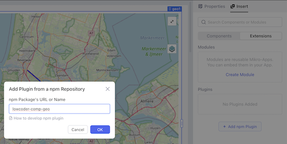
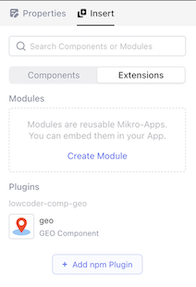
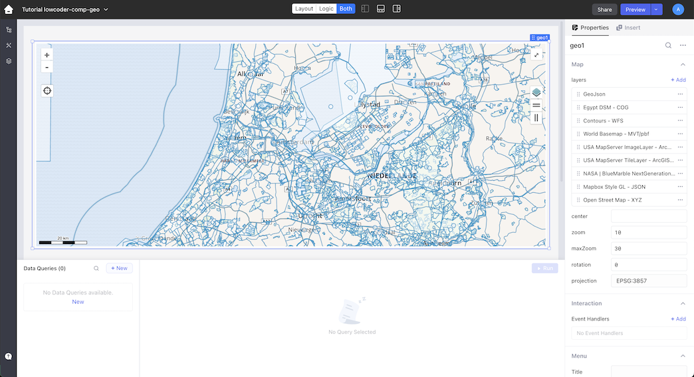
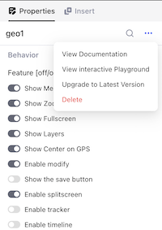

# How to start using the lowcoder-geo-plugin

## Adding the plugin to lowcoder
Login to the lowcoder website and select or create the application you would like to use the lowcoder-comp-geo.
Click on `insert` and then select `Extensions` now click on the `Add npm Plugin` and you should see the first image. Enter `lowcoder-comp-geo` in the input box and hit `ok` to confirm.  After that as shown in the second image the lowcoder-comp-geo plugin should be loaded and added to the extension page. 

## Start using the plugin
When you have installed the plugin. Select the plugin from the extensions and `drag&drop` it onto you application canvas. You should seen now a default configured `geo1` component on you screen. By default we focus the maps on your GPS or IP location, therefor the first time the browser will ask you if it is allowed to use your GPS location.

## Configuration options
There are a lot of configuration options which allow you to modify the behavior of the plugin. Within the [Configuration](configure) part of our documentation we describe all options in detail. But for this tutorial we just describe the different sections within `properties`.

* **Map** is used to configure the different GEO layers available within the geo-component and the default configuration of the geo-viewer.

* **Interaction** is the place where you can listen to events happening within the geo-component. For example you can use `onFeature` to perform an action when some clicks on a geo feature on the map. 

* **Menu** is by default invisible but when enabled in `behavior` a side menu becomes available. By setting menu title and content you can customize the information shown.

* **Timeline** is by default disabled by when enabled in `behavior` a timeline with start and end date is shown at bottom of the geo-component. Layers can be connected to this timeline by setting the timeline date within the layer.  

* **Styles** are used to configure the style of the component. By default we use the default styles defined by lowcoder.

* **Behavior** is the place where you can alter the behavior of the plugin. You can change simply change the behavior by turning on/off a switch. 

* **Variables** are not configurable within the UI, but can be used within the application by referencing the variable through the component name. ex: `geo1.feature` 

* **Methods** are not configurable within the UI, but can be used within the application by calling the method through the component name. ex: `geo1.addFeature('layer',{})` 

## Upgrading a plugin
To upgrade the plugin to the latest version is easy. Just select the `geo component` with the designer window of lowcoder. It should show the `properties` on the right side. On the right side of the component name you should see `...` click on it and a popup menu will show. No click on `Upgrade to Latest Version` wait a bit and you are all done.

