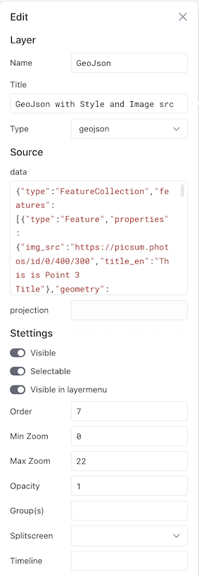
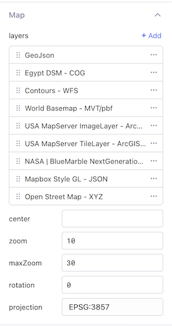
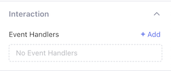
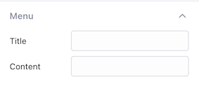
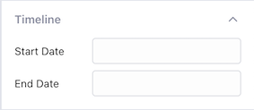
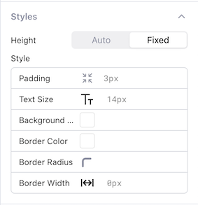
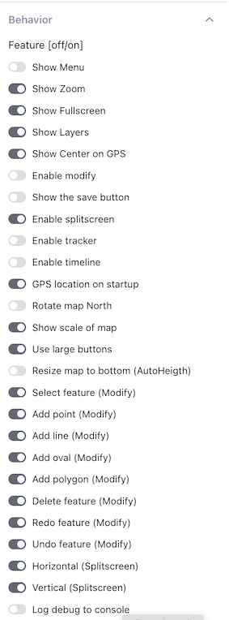

# Configuration options

## Layers

Map is the first property section you should configure. It's the base and any configuration made here will redraw the geo component.

Layers are the hart of any GEO application. By default we provide a number of examples layers as you can see in the left figure. By clicking de `+Add` button you can add a new layer or by clicking on `...` you can delete or duplicate a layer.

By dragging a layer items up or down you can change the `order` of the layer, if it is not defined within the layer properties.

Be careful not to add to many layers because in some cases all data is loaded before showing. Some layer technics will load different data when the viewpoint or zoom has changed. You as a developer can also can reduce the data loading by for example catching the `onBbox` from within *interaction* and based on the `geo1.bbox` only load features within this bbox by calling `geo1.addFeatures('layer',{a GEOJson})`

There are many places where you can find open data sources serving information GEO data. For a starting point look at this [Wiki Page](https://en.wikipedia.org/wiki/List_of_GIS_data_sources) 
 

## Layer options

|Level|Option|Description|
|---|---|---|
|Map|Layers|An draggable array containing all layers||
||Center|Coordinates [longitude,latitude] to center the map on when loading. When empty and behavior `GPS location on Startup` is `on` it will center on your current position|
||Zoom|The initial zoom you want to use. Where `0` is worldwide, `6` a country, `10` is region and `18` street level|
||Max Zoom|The `default` maximum zoom allowed for a layer. Can be overruled within a layer|
||Rotation|The rotation of a map. Defaults to `0` north. By enabling behavior `Rotate map North` a button will be added to map allowing user to set rotation to `North`|
||Projection|The projection of all features shown on the map|
|Edit|Name|The name of the layer. This name is used by `Methods` to find the correct layer and should therefor be unique|
||Title|The title of the layer shown in layer-menu on map. You will need to set behavior `Show Layers` to `on` to see the layer-menu button.|
||Type|The type of the GEO layer. Changing this type will change the *Source* properties.| 
||Type [`mvt`]|A `VectorTileSource` containing `MVT` data| 
||Type [`wms`]|A `TileLayer`  containing `TileWMS` data| 
||Type [`wfs`]|A `VectorLayer` containing `Vector` data by `url`| 
||Type [`xyz`]|A `TileLayer` containing `XYZ` data| 
||Type [`geojson`]|A `VectorLayer` containing `Vector` data by `data object`| 
||Type [`cog`]|A `TitleLayer` containing `GEOTiff` data| 
||Type [`stylegl`]|A `VectorTileLayer` containing `VectorSourceTile` data | 
||Type [`arcgis-mapserver-tile`]|A arcgis `TileLayer` containing `TileArcGISRest` data| 
||Type [`arcgis-mapserver-image`]|A arcgis 'ImageLayer' containing `ImageArcGISRest` data | 
|Source|Data [`geojson`]|An `object` or `string` containing a GEOJson describing the features to load. You can use a result of a static query here `{{query1.data}}`, but be careful with update, because it will update the entire map. For dynamic updates use the method `geo1.addFeatures('layer',{})`|
||Projection [`geojson`,`cog`,`stylgl`]|The projection of the data used|
||Url [`mvt`,`wms`,`wfs`,`xyz`,`cog`,`stylegl`,`arcgis-mapserver-tile`,`arcgis-mapserver-image`]|The url for the source map data|
||Attributions [`mvt`]|The Attributions used|
||Params [`wms`,`arcgis-mapserver-tile`,`arcgis-mapserver-image`]|The parameters used|
||ServerType [`wms`]|Sever type|
||CrossOrigin [`wms`,`arcgis-mapserver-tile`,`arcgis-mapserver-image`]|CrossOrigin options|
||TileSize [`cog`]|Size of the tile|
||Nodata [`cog`]|Nodata property|
||Style [`stylegl`]|Style settings used within for the layer|
||Ratio [`arcgis-mapserver-image`]|Rotation in degrees of map|
|Settings|Visible|Is the layer visible in the viewer, can be changed by user in the layer-menu|
||Selectable|Are features on this map selectable by user|
||Visible in layer menu|Is this layer visible in the layer-menu|
||Min Zoom|The minimal zoom of the layer|
||Max Zoom|The maximal zoom of the layer|
||Opacity|The opacity of the layer, `0 = 0%` and `1 = 100%`|
||Group(s)|`String` or `Array of Strings` containing the groups this layer belongs to|
||Splitscreen|By settings `left` or `right` this layer will be visible in splitscreen mode on the left or right side of the split. You can select multiple layers on left and right|
||Timeline|When you set here a `year/date` this layer will be added to the timeline|

## Interaction

GEOComp exposes events that can be used within lowcoder. Just click on the `+Add` to add one of the events below. All events can always use `geo1.event` to access the last event information.

- `onInit` - Is fired when the Map initialized. `Event` variable contains the `map object` **use a bounce 10ms** when catching this event
- `onLoad` - Is fired when a Layers has finished (partial )loaded data
- `onModify` - Is fired when a there is a feature added/modified/deleted on the draw layer
- `onTimeline` - Is fired when user moves the timeline 
- `onClick` - Is fired when clicked on the Map not a feature
- `onSelect` - Is fired when a feature is clicked, use `feature variable` to access information
- `onBbox` - Is fired when he bbox of the map changed, use `bbox variable` to access information
- `onZoom` - Is fired when the zoom has changed
- `onEvent` - Is fired on all other internal events, use `event variable` to access information
 

## Menu

When the menu behavior is enabled, you will see in the top left the menu icon. By clicking on the menu icon a content window is opened on the left site. This site menu can be handy is you are in full screen mode or have a screen filling app on a mobile phone.

- `title` - Title used within menu
- `content` - Content of the menu used
 

## Timeline

Timeline is used to scroll through a set of historical layers. When a layer has a timeline year/date it is automatically connected to this feature. Timeline layers are also hidden and added to the timeline group.

- `Start Date` - Start Year/Date of the timeline
- `End Date` - End Year/Date of the timeline
 

## Styles

Control the styling elements of the map

- `Height` - When `height` is `Auto` you can use behavior `scaleToBottom`, when `fixed` you can create your own size
- `Padding` - The padding around the map
- `Text sizing` - The text size used within the map (only small icons)
- `Background color` - The background color of the padding area
- `Border color` - The border color
- `Border radius` - The border radius
- `Border width` - The border width
 

## Behavior

Behaviors control the look & feel of the map. Changing them will always regenerated the view.

- `menu` - Toggle the menu button
- `zoom` - Toggle the zoom button
- `fullscreen` - Toggle the fullscreen 
- `layers` - Toggle the layer menu button.
- `center` - Toggle the move to my location (center) button
- `modify` - Toggle the geometry editing of features, will impact all other modify. The information can be read from the `draw` layer
- `save` - Toggle the save button, when button is clicked the onSave event is triggered 
- `splitscreen` - Toggle the split screen. A split screen can be used to show two or more layers beside each other.
- `tracker` - Toggle the tracker options. The tracker information can be read from the layer `tracker`
- `timeline` - Toggle the timeline slider. Timeline allow you too connect different layers to a specific moment in time. By moving the timeline you can see the difference between the layers 
- `gpsCentered` - Toggle the center map on user's location on startup
- `north` - Toggle the show north button to reset bearing
- `scale` - Toggle the map scale display.
- `largeButtons` - Toggle between large en small toolbar icons
- `scaleToBottom` - When toggled on and `Height=Auto` the map is size to the bottom of the visible screen.
- `"modify:move"` - Toggle allow moving geometries
- `"modify:point"` - Toggle adding points
- `"modify:line"` - Toggle adding lines
- `"modify:oval"` - Toggle adding ovals
- `"modify:polygon"` - Toggle adding polygons.
- `"modify:delete"` - Toggle delete of feature
- `"modify:redo"` -  The redo button
- `"modify:undo"` - The undo button
- `"modify:clear"` - The clear button
- `"modify:snap"` - Toggle snapping on or of during move, delete
- `"splitscreen:horizontal"` - Toggle horizontal split screen button
- `"splitscreen:vertical"` - Toggle vertical split screen button
- `debug` - Enable debug messages of all events to console
 

## Variables
|Variable|type|Description|
|---|---|---|
|events|object|An object containing all events and there last values.|
|event|object|An object containing the last event values|
|bbox|array|An `[array of 4 floats]` containing the visible coordinates of the map |
|feature|object|Contains `extent` an `[array of 4 floats]` the feature coordinates clicked, `layer` containing the name of the layer, `properties` all properties of the feature clicked|

## Methods
|Method|Parameters|Description|
|---|---|---|
|animate|`coordinates`:array, `duration`:number, `properties`:object,`animation`:string|Perform animation on the specified coordinates and for the duration in milliseconds. properties |
|map|[returns `MapObject`]|Return the last `map`|
|notify|`message`:string, `duration`:number| Show notify `message` at bottom of map. Duration defaults too 2000ms|
|showPopup|`coordinates`:array,`message`:string|Show a popup at the Coordinates with message
|setFeatures|`layer`:string, `data`:object/string, `clear`:boolean, [returns `boolean`]|Add one ore more GEOJson features to the given layer, when clear is true all features of layer will be deleted before adding. When `merge` is true merge will done base on feature type and location. |
|getFeatures|`layer`:string [returns `promise`]|Get all features returning a `GEOJson` for the given layer|
|clearFeatures|`layer`:string|Clear all features for the given layer|
|setConfig|`json`:object,`filter`:string/array |Set configuration of the plugin by json, filter by properties. When filter is empty array[] all items will be update, when null only layers is update or the specified in filter|
|getConfig|`filter`:string/array [returns `object`]|Get configuration of the plugin by returning `json`, filter by properties. When filter is empty array[] all items will be returned, when null only layers is update, or the specified in filter|
|getZoom|[returns `float`]|Get current zoom value|
